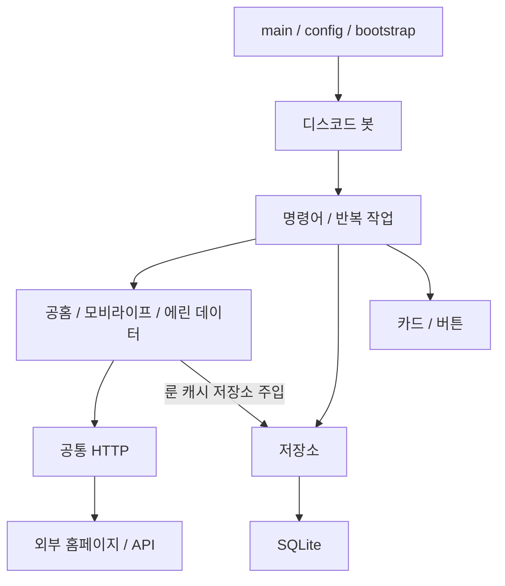

<!-- 머장봇의 사이트별 구조, 파일별 책임, 기능과 구동 방법을 설명합니다. -->
# 머장봇

마비노기 모바일의 공지·어비스·시세·악보·서버 상태·직업별 룬 통계를 제공하는 디스코드 봇입니다.

## 기능

| 명령어 | 기능 |
| --- | --- |
| `/어비스` | 출현 여부, 다음 출현 시각, 남은 시간 |
| `/어구알림` | 어비스 사전 알림 멘션 신청·해제 |
| `/시세 아이템` | 이름 부분 검색, 최저가·수량·가격 변동·이미지. 최대 100개, 페이지당 4개 |
| `/악보 검색어` | 제목·제작자 검색, 원본 링크·연주 유형·파트 수. 2글자 이상, 최대 30개, 페이지당 6개 |
| `/청소 개수` | 최근 메시지 중 머장봇 메시지만 삭제. 조회 범위 기본 200개, 최대 500개 |
| `/룬통계 직업` | 21개 직업 자동완성, 룬 채용률·장신구 조합·콤보 운용 정보 |

시세·악보 페이지 버튼은 5분 후 비활성화됩니다.

### 새로 추가된 룬 통계

룬 통계는 공홈이나 모비라이프가 아닌 **에린 데이터(erinndata.pages.dev)** 에서 가져오므로 `sites/erinndata/`로 분류했습니다.

- 장신구 채용률: 80% 이상 / 40~79% / 10~39% 구간
- 방어구: 각성·용문장·침식·그 외 주요 채용 룬
- 무기·엠블럼: 상위 3개와 실제 채용률
- 실전 장신구 조합: 개조·세공·비고, 최대 3개 표시
- 콤보·운용 제보: 해당 직업의 표가 있을 때 표시
- 데이터 기준일 표시. 기존 최신 패치와 같이 한줄 요약은 표시하지 않음
- SQLite·메모리 캐시, 시작 후 및 6시간마다 갱신. 캐시가 없는 직업을 조회하면 즉시 수집
- 페이지 구조가 달라져 핵심 데이터를 읽지 못하거나 저장에 실패하면 기존 캐시 유지

기존 `rune_stats_bootstrap.py`, `rune_stats_patch.py`, `rune_stats_hotfix.py`, `rune_stats_combo_patch.py`, `rune_stats_cleanup.py`의 최종 동작을 통합했습니다. 실행 시 함수를 바꿔 끼우는 패치 파일은 더 이상 필요하지 않습니다.

### 자동 작업

| 작업 | 주기·동작 |
| --- | --- |
| 공지·업데이트 | 1분마다 확인. DB가 처음 비어 있으면 기존 글을 기록만 하고 이후 새 글 전송 |
| 어비스 데이터 | 1분마다 갱신. 명령어 실행 시에도 조회 |
| 어비스 사전 알림 | 15초마다 확인하여 출현 60·30·10·1분 전 전송. 1분 전에는 다음 회차도 표시 |
| 서버 상태 | 1분마다 기존 메시지 갱신, 채널명 앞 🟢/🔴 변경 |
| 룬 통계 | 시작 후 첫 갱신 및 6시간마다 조회, DB 캐시는 시작 시 복원 |
| DB 정리 | 시작 후 첫 실행 및 7일마다 공지 최근 500개·어비스 알림 최근 30일 유지. 룬 캐시·구독자는 유지 |

일반 어비스 주기는 36시간 15분, 출현 지속 시간은 15분으로 계산합니다. 점검 후 예상값은 일반 출현 기준과 구분합니다.

## 사이트별 수집 방식

| 출처 | 방식 |
| --- | --- |
| 공홈 | 공지·업데이트 HTML을 BeautifulSoup으로 파싱 |
| 모비라이프 어비스 | `/d/api/v1/eab` API 조회·AES 복호화 |
| 모비라이프 시세 | `/v1/market/prices` OpenAPI·Bearer 인증 |
| 모비라이프 악보 | `/d/api/v1/sheet-music` API 조회 |
| 모비라이프 점검 | `/d/api/v1/maintenance-status` API 조회 |
| 에린 데이터 | `https://erinndata.pages.dev/cheatsheet/` HTML에서 직업별 텍스트·표 추출 |

모비라이프 어비스·악보·점검은 기본 프록시를 사용하며 `MOBLIFE_PROXY_BASE`를 비우면 직접 조회합니다. 시세는 별도 OpenAPI 도메인으로 요청하며 인증 키를 프록시에 보내지 않습니다. 룬 통계는 에린 데이터에 직접 요청하고 API 키가 필요 없습니다.

## 프로젝트 구조와 파일별 역할

`models / sources / services`를 최상위에서 나누지 않고 **사이트별로 데이터 형식·수집·처리를 모았습니다.** 봇 자체의 저장 데이터와 디스코드 입출력은 별도 계층으로 둡니다.

```text
merjangbot-main/
├─ discord_bot/  # 디스코드 연동
│  ├─ commands/  # 슬래시 명령어
│  │  ├─ __init__.py  # 슬래시 명령어를 기능별로 등록합니다.
│  │  ├─ abyss.py  # /어비스 조회와 /어구알림 구독 신청·해제를 처리합니다.
│  │  ├─ cleanup.py  # /청소로 현재 채널에서 이 봇이 보낸 메시지만 삭제합니다.
│  │  ├─ market.py  # /시세 입력을 처리하고 조회 결과 카드와 페이지 버튼을 전송합니다.
│  │  ├─ rune_stats.py  # /룬통계 명령어와 21개 직업 자동완성을 등록하고 캐시된 통계를 표시합니다.
│  │  └─ sheets.py  # /악보 입력을 처리하고 검색 결과와 페이지 버튼을 전송합니다.
│  ├─ jobs/  # 주기적 작업
│  │  ├─ __init__.py  # 주기적인 조회·알림·정리 작업을 실행합니다.
│  │  ├─ abyss.py  # 어비스 데이터를 갱신하고 구독자 멘션을 포함한 중복 없는 사전 알림을 보냅니다.
│  │  ├─ database_cleanup.py  # 7일마다 저장소 정리 기능을 실행합니다.
│  │  ├─ notices.py  # 공지를 주기적으로 확인하고 새 글을 전송한 뒤 전송 이력을 저장합니다.
│  │  ├─ rune_stats.py  # 시작 후와 매 6시간마다 룬 통계를 갱신하며 오류 시 이전 캐시를 유지합니다.
│  │  └─ server_status.py  # 점검 상태에 따라 채널명과 기존 상태 메시지를 1분마다 갱신합니다.
│  ├─ presenters/  # 메시지 카드·표시 문구
│  │  ├─ __init__.py  # 조회 결과를 디스코드 카드와 한글 문구로 변환합니다.
│  │  ├─ abyss.py  # 어비스 현재 상태와 사전 알림을 한글 디스코드 카드로 만듭니다.
│  │  ├─ market.py  # 시세 결과를 이미지·가격 변동이 포함된 페이지별 카드로 만듭니다.
│  │  ├─ notices.py  # 공식 공지와 업데이트 링크를 디스코드 카드로 만듭니다.
│  │  ├─ rune_stats.py  # 직업별 룬 통계와 콤보 운용 정보를 디스코드 카드로 구성하며 한줄 요약은 표시하지 않습니다.
│  │  ├─ server_status.py  # 서버 상태 카드와 상태 표시가 붙은 채널명을 만듭니다.
│  │  └─ sheets.py  # 악보 검색 결과를 제목·제작자·원본 링크 카드로 만듭니다.
│  ├─ views/  # 공통 버튼
│  │  ├─ __init__.py  # 디스코드 메시지의 공통 버튼을 제공합니다.
│  │  └─ pagination.py  # 시세·악보에서 함께 사용하는 이전·다음 버튼과 만료 처리를 제공합니다.
│  ├─ __init__.py  # 디스코드 연결과 사용자 입출력을 담당합니다.
│  └─ bot.py  # Discord 클라이언트의 수명주기·명령어 동기화·반복 작업 시작과 종료를 관리합니다.
├─ sites/  # 사이트별 데이터 조회·해석·처리
│  ├─ erinndata/  # 에린 데이터 룬 통계
│  │  ├─ __init__.py  # 에린 데이터의 직업별 룬 통계 조회와 데이터 해석을 제공합니다.
│  │  ├─ models.py  # 룬 통계 지원 직업과 채용률·장신구 조합·콤보 운용 데이터 형식을 정의합니다.
│  │  ├─ parser.py  # 룬 채용률·장신구 조합·콤보 운용 표를 파싱하고 핵심 데이터 누락을 검증합니다.
│  │  └─ runes.py  # 룬 통계를 조회하고 메모리·영속 캐시를 갱신하며 실패 시 이전 데이터를 유지합니다.
│  ├─ moblife/  # 모비라이프 API
│  │  ├─ __init__.py  # 모비라이프의 어비스·시세·악보·점검 조회를 제공합니다.
│  │  ├─ abyss.py  # 어비스 API 조회·복호화와 출현 주기·현재 상태·알림 시점을 계산합니다.
│  │  ├─ client.py  # 모비라이프의 프록시·OpenAPI 주소와 인증 헤더를 관리합니다.
│  │  ├─ maintenance.py  # 점검 상태 API의 응답을 검증하고 시각·경과 시간을 계산합니다.
│  │  ├─ market.py  # 시세 API를 조회하고 아이템 이름 검색·중복 제거·정렬을 수행합니다.
│  │  ├─ models.py  # 모비라이프 조회 결과의 데이터 형식을 정의합니다.
│  │  └─ sheets.py  # 악보 API를 조회하고 여러 응답 형식에서 제목·제작자·메타데이터를 추출합니다.
│  ├─ official/  # 마비노기 모바일 공식 홈페이지
│  │  ├─ __init__.py  # 마비노기 모바일 공식 홈페이지의 공지 조회를 제공합니다.
│  │  ├─ models.py  # 공식 홈페이지에서 가져오는 게시물의 공통 데이터 형식을 정의합니다.
│  │  └─ notices.py  # 공식 공지·업데이트 HTML을 조회하고 게시물 목록으로 변환합니다.
│  ├─ __init__.py  # 사이트별 데이터 조회와 처리 기능을 모읍니다.
│  └─ http.py  # 사이트 조회용 HTTP 세션을 재사용하고 타임아웃·응답 오류를 처리합니다.
├─ storage/  # SQLite 저장소
│  ├─ __init__.py  # 봇 운영 데이터를 SQLite에 저장하고 조회합니다.
│  ├─ abyss.py  # 출현 시각과 사전 알림 분 단위로 어비스 전송 이력을 관리합니다.
│  ├─ cleanup.py  # 오래된 공지·알림 기록을 정리하고 SQLite 파일을 압축합니다.
│  ├─ database.py  # SQLite 연결과 운영 데이터 테이블 초기화를 담당합니다.
│  ├─ notices.py  # 공지 전송 이력을 조회·저장하여 같은 게시물의 중복 알림을 막습니다.
│  ├─ rune_stats.py  # 기존 룬 통계 캐시 테이블을 그대로 사용해 직업별 데이터와 갱신 시각을 저장합니다.
│  └─ subscriptions.py  # 어비스 알림 구독자의 신청·해제와 목록 조회를 담당합니다.
├─ .env.example  # 이 파일을 .env로 복사한 뒤 실제 봇 토큰과 채널 ID를 입력합니다.
├─ .gitignore  # 비밀 설정·운영 DB·가상환경과 캐시를 Git에서 제외합니다.
├─ README_DEPLOY.txt  # 사이트별로 분리된 머장봇의 Railway 배포 방법을 안내합니다.
├─ app_core.py  # 이전 실행 명령과의 호환을 위해 새 진입점으로 연결합니다. 본체는 사이트·저장소·디스코드 패키지로 분리되었습니다.
├─ bootstrap.py  # 설정·수집기·저장소를 생성하여 디스코드 봇에 명시적으로 연결합니다.
├─ config.py  # 환경변수를 가장 먼저 읽고 채널·API·DB 설정을 검증합니다.
├─ main.py  # 설정을 읽고 머장봇을 실행하는 유일한 진입점입니다.
├─ mise.toml  # 배포 환경의 Python 버전을 지정합니다.
└─ requirements.txt  # 실행에 필요한 Python 라이브러리를 지정합니다.
```

각 파일 맨 위에는 설명만 적은 한글 주석이 있습니다. `__init__.py`는 해당 폴더를 Python 패키지로 선언합니다.

### 연결 관계



- `main.py`, `config.py`, `bootstrap.py`: 환경설정과 구성요소 생성·연결
- `sites/`: 외부 조회·해석·계산. 디스코드를 import하지 않음
- `storage/`: DB 연결·테이블·조회·저장. 기존 DB 형식 유지
- `discord_bot/commands/`: 입력 검증과 조회 결과 응답
- `discord_bot/jobs/`: 반복 실행과 알림 전송. 전송 성공 후 기록
- `discord_bot/presenters/`, `views/`: 화면 문구·카드·버튼

룬 통계 서비스에는 저장소 객체를 주입합니다. 사이트 코드는 SQL을 직접 실행하지 않고 캐시 저장소의 조회·저장 기능을 호출합니다. 시작 시 DB와 캐시를 초기화한 뒤 반복 작업을 시작하며 종료 시 작업과 HTTP 세션을 닫습니다. import만으로 로그인하거나 DB를 만들지 않습니다.

## 실행

배포 Python 설정은 기존과 같은 3.13입니다. 구조 분리 검증은 Python 3.12 환경에서도 수행했습니다.

프로젝트 폴더에서 다음과 같이 실행합니다.

```powershell
python -m venv .venv
.venv/Scripts/python.exe -m pip install -r requirements.txt
Copy-Item .env.example .env
# .env 파일에 실제 값을 입력한 다음 실행합니다.
.venv/Scripts/python.exe main.py
```

이미 `.env`가 있으면 복사하지 않고 기존 파일을 사용합니다. Linux 가상환경 경로는 `.venv/bin/python`입니다.

| 설정 | 설명 |
| --- | --- |
| `DISCORD_TOKEN` | 필수. 디스코드 봇 토큰 |
| `NOTICE_CHANNEL_ID` | 필수. 공지 알림 채널 |
| `ABYSS_CHANNEL_ID` | 필수. 어비스 알림 채널 |
| `SERVER_STATUS_CHANNEL_ID` | 서버 상태 채널. 예시 파일에 실제 ID 입력. 변수 자체가 없으면 기존 코드의 기본 ID 사용 |
| `MOBLIFE_API_KEY` | 시세 조회용. 다른 기능에는 필수 아님 |
| `DB_FILE` | 기본 `data.db`. 상대 경로는 프로젝트 폴더 기준, 절대 경로도 가능 |
| `MOBLIFE_PROXY_BASE` | 기본값은 `.env.example` 참고. 빈 값이면 직접 조회 |
| `MOBLIFE_EAB_KEY` | 선택. 어비스 복호화 키 재정의 |
| `TZ` | 호스팅 환경 시간대. 표시 시각은 한국 시간으로 변환 |

기존 `BOT_CHANNEL_ID`는 실제 사용되지 않던 값으로 제거했습니다. 봇에는 채널 보기·메시지 보내기·링크 포함·메시지 기록 보기 권한이 필요하며 상태 채널명 변경에는 채널 관리 권한이 필요합니다.

## 기존 버전에서 이전

1. 기존 봇을 종료합니다.
2. 새 파일과 `sites/`, `storage/`, `discord_bot/` 전체를 배포합니다.
3. 기존 `.env`와 `data.db`를 유지하고 DB 경로·채널 ID를 확인합니다.
4. `python main.py`로 시작합니다.

기존 `sent_posts`, `abyss_alerts`, `abyss_subscribers`, `rune_stats_cache` 테이블은 그대로 호환됩니다. `DB_FILE` 설정을 실제로 사용하므로 이전 DB가 다른 폴더에 있으면 해당 절대 경로를 지정하세요. Railway는 `/data` 볼륨과 `DB_FILE=/data/data.db`를 사용합니다.

`app_core.py`는 이전 실행 명령을 위한 작은 호환 진입점입니다. `legacy_main.py`와 루트의 `rune_stats_*.py` 패치 파일은 제거되었습니다. 배포 요약은 `README_DEPLOY.txt`에 있습니다.

## 운영 범위

알림 채널은 공통 설정이며 구독자는 서버 구분 없이 저장하는 기존 동작을 유지합니다. `/청소`의 호출자 관리자 권한 제한은 별도로 추가하지 않았습니다. 디스코드 전송 성공 후 DB 기록 전에 프로세스가 중단되는 경우에는 알림이 중복될 수 있습니다.
